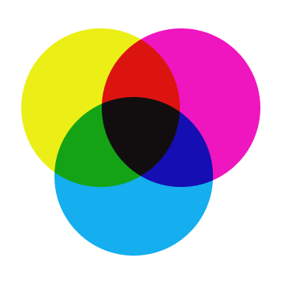
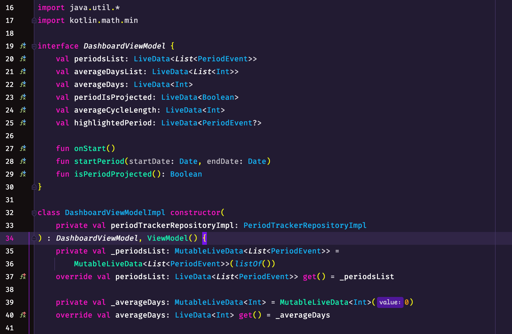
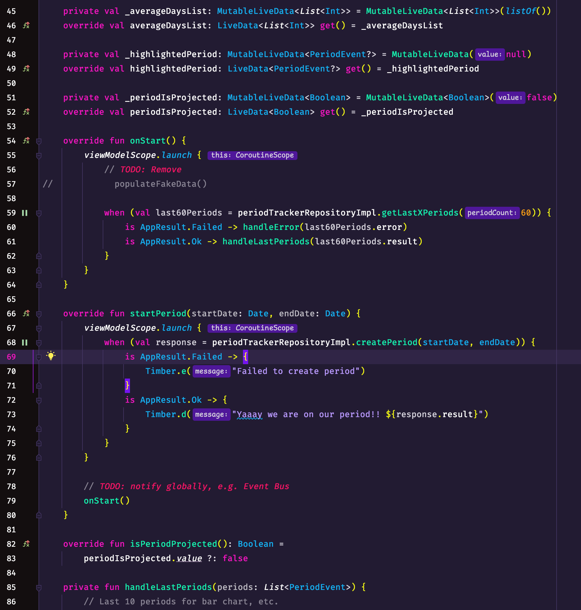
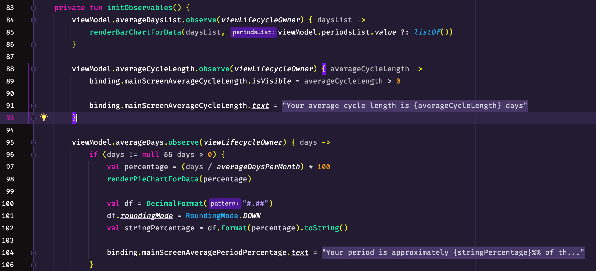
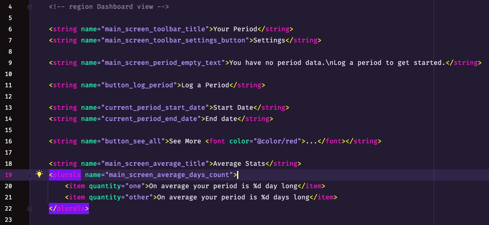
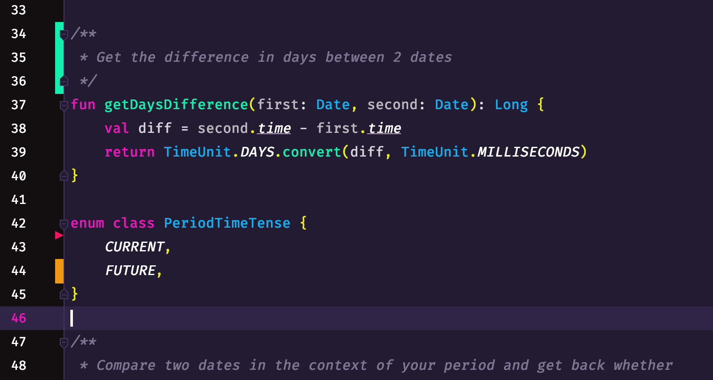
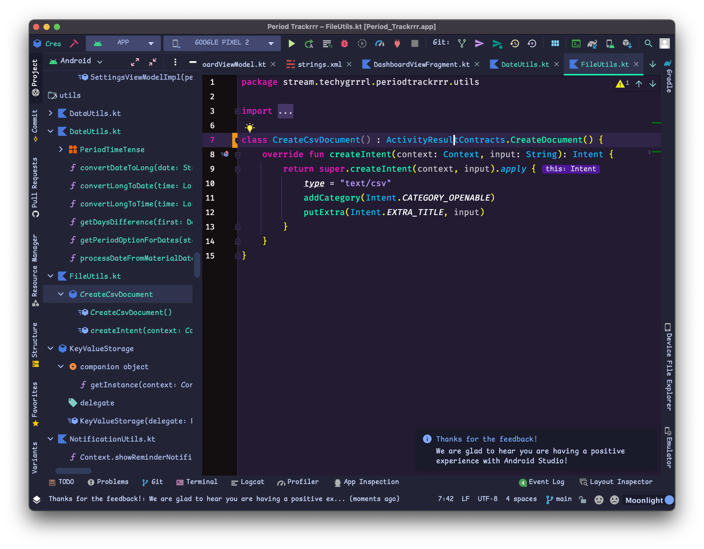

# This repository is now archived because the colour scheme was bundled in with the UI theme. This is the newest repository: https://github.com/techygrrrl/techygrrrl-cmyk-colourrrs-jetbrains

---
---
---
---
---
---

<h1 align="center">CMYK colourrrs</h1>

  

  <strong>CMYK colourrrs</strong> for Jetbrains IDE's is a dark colour scheme.

  by <a href="https://techygrrrl.stream">techygrrrl</a>

## About

The colour scheme has been optimized for Android development with Kotlin and includes styles for XML, HTML, and Java.

Better support for other Jetbrains IDE's coming soon.

## Usage

1. Download or clone the repository
2. In your IDE preferences, navigate to Editor &rarr; Colour scheme and choose Import.
3. Import the `.icls` file

## Screenshots

Example Android view model with an interface.

In the following you can see comments, todos, labels, and brace highlighting.

Example Android fragment.

Example XML strings file.

Example Git gutter.

In the below screenshot, I am using the [Material UI plugin](https://plugins.jetbrains.com/plugin/8006-material-theme-ui) UI theme called Moonlight with UI font [Comic Shanns](https://github.com/shannpersand/comic-shanns) and editor font [Fira Code](https://github.com/tonsky/FiraCode) without ligatures.

